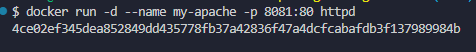
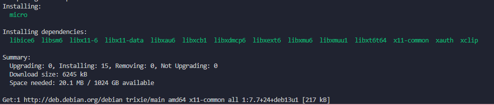
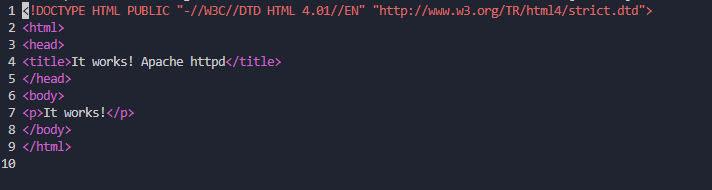
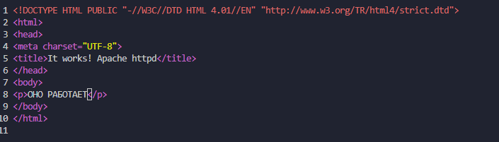
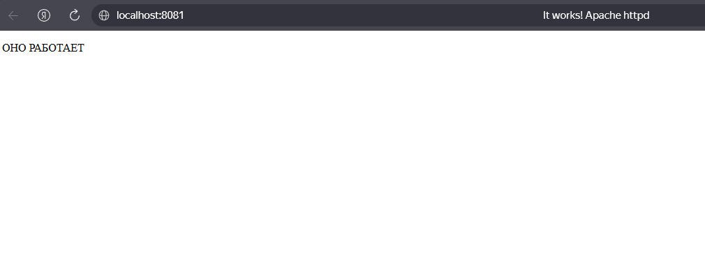

# Docker - Практические работы

## 📋 Описание проекта

Этот репозиторий содержит практические работы по созданию и управлению Docker-контейнерами из готовых образов.

## 🎯 Цель работы

Освоить базовые навыки работы с Docker:
- Загрузка образов из официального репозитория
- Запуск и управление контейнерами
- Проброс портов
- Монтирование томов
- Работа с логами и отладка
- Остановка и удаление контейнеров

## 📁 Структура репозитория

```
README.md # Главный файл с описанием всех работ (вы здесь)
myNotes/
├── Apache.md # Работа с веб-сервером Apache
```

## APACHE

### Запуск контейнера



### Переход в контейнер


### Установка текстового редактора micro



### Открытие файла index.html



### Добавление CHARSET



### Страница в браузере

